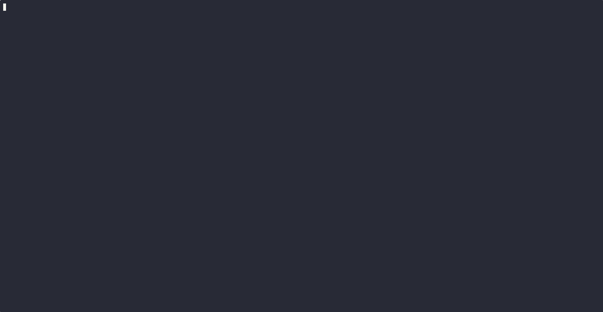

# Concept: Порівняльний аналіз інструментів локального розгортання Kubernetes

---

## Вступ

Для локальної розробки та тестування Kubernetes-додатків існує кілька популярних інструментів. Розглядаються три варіанти:

- **minikube** — еталонний інструмент для локального Kubernetes від самої спільноти k8s. Розгортає однонодний кластер безпосередньо на машині або у VM/контейнері.
- **kind** (Kubernetes IN Docker) — запускає Kubernetes всередині Docker-контейнерів; орієнтований насамперед на CI/CD та тестування самого k8s.
- **k3d** — обгортка навколо k3s (Kubernetes від Rancher/SUSE), яка запускає кластер у Docker-контейнерах. Оптимізований для швидкого старту та багатонодних конфігурацій.

---

## Характеристики

| Характеристика | minikube | kind | k3d |
|---|---|---|---|
| **Підтримувані ОС** | Linux, macOS, Windows | Linux, macOS, Windows | Linux, macOS, Windows |
| **Підтримувані архітектури** | amd64, arm64, armv7 | amd64, arm64 | amd64, arm64 |
| **Container runtime** | Docker, Podman, VirtualBox, VMware, KVM, Hyper-V | Docker, Podman | Docker (Podman — experimental) |
| **Мультинодні кластери** | Обмежено (з v1.10.1) | ✅ Так | ✅ Так (легко) |
| **Швидкість розгортання** | ~2–3 хв | ~1–2 хв | ~30 сек – 1 хв |
| **Вбудований Dashboard** | ✅ Так (`minikube dashboard`) | ❌ Ні | ❌ Ні |
| **Вбудований Registry** | ✅ Так (addon) | Потребує налаштування | ✅ Так (`k3d registry`) |
| **LoadBalancer підтримка** | ✅ (через `minikube tunnel`) | Потребує MetalLB | ✅ Вбудований |
| **Автоматизація / CI-CD** | Середня | Висока | Висока |
| **Podman підтримка** | ✅ Стабільна | ✅ Стабільна | ⚠️ Експериментальна |
| **Документація** | ✅ Відмінна | ✅ Добра | ✅ Добра |
| **Активність спільноти** | Дуже висока | Висока | Висока |
| **Версія Kubernetes** | Точно відповідає upstream | Точно відповідає upstream | k3s (сумісний підмножина) |

---

## Переваги та недоліки

### minikube

**Переваги:**
- Офіційний інструмент Kubernetes-спільноти, найкраща документація
- Вбудований Dashboard, Metrics Server, Ingress, Registry — усе через `minikube addons`
- Підтримує різноманітні драйвери (Docker, Podman, VM), найбільша гнучкість
- Ідеально підходить для навчання та першого знайомства з Kubernetes

**Недоліки:**
- Найповільніший старт серед трьох
- Однонодний за замовчуванням (мультинод — складніше у налаштуванні)
- Ресурсомісткий (особливо з VM-драйвером)
- Менш зручний для автоматизації у скриптах/CI

---

### kind

**Переваги:**
- Ідеальний для CI/CD: легко інтегрується в GitHub Actions, GitLab CI тощо
- Підтримує справжній upstream Kubernetes (не підмножину)
- Стабільна підтримка Podman
- Легке створення мультинодних кластерів через YAML-конфіг

**Недоліки:**
- Немає вбудованих зручностей (Dashboard, Registry, LoadBalancer — все вручну)
- Орієнтований більше на тестування K8s, ніж на розробку додатків
- Менш зручний для швидких ітерацій у локальній розробці
- Образи треба окремо завантажувати в кластер (`kind load docker-image`)

---

### k3d

**Переваги:**
- Найшвидший старт: кластер піднімається за 20–30 секунд
- Вбудований реєстр образів (`k3d registry create`)
- Вбудований LoadBalancer (Traefik + ServiceLB)
- Легке створення та знищення мультинодних кластерів однією командою
- Мінімальне споживання ресурсів
- Зручний для локальної розробки з швидкими ітераціями

**Недоліки:**
- Використовує k3s — спрощений Kubernetes; деякі upstream-функції відсутні або відрізняються
- Podman-підтримка поки експериментальна
- Менша спільнота порівняно з minikube
- Не підходить для тестування специфічних upstream K8s-поведінок

---

## Порівняльна таблиця (підсумок)

| Критерій | minikube | kind | k3d |
|---|:---:|:---:|:---:|
| Простота встановлення | 3 | 3 | 3 |
| Швидкість розгортання | 2 | 3 | 5 |
| Зручність локальної розробки | 4 | 2 | 5 |
| CI/CD інтеграція | 3 | 5 | 4 |
| Мультинодні кластери | 2 | 4 | 5 |
| Вбудовані інструменти | 5 | 1 | 4 |
| Споживання ресурсів | 2 | 4 | 5 |
| Podman-сумісність | 4 | 4 | 2 |
| Документація | 5 | 4 | 4 |
| **Загальний бал** | **30** | **30** | **37** |

*Бали за шкалою 1–5, де 5 — найкращий результат.*

---

## Висновки

Рекомендованим інструментом є **k3d** з таких причин:

1. **Швидкість ітерацій** — k3d дозволяє підняти чистий кластер за 30 секунд, що суттєво прискорює цикл розробки.
2. **Вбудований реєстр** — зручно пушити образи без зовнішніх залежностей.
3. **Мінімальні вимоги до ресурсів** — критично при роботі на особистих машинах розробників.
4. **Простота скриптування** — легко автоматизувати повний цикл `up → deploy → test → down`.
5. **Підготовка до масштабування** — мультинодні конфігурації дозволяють симулювати продакшн-середовище.

### Щодо ризику Docker-ліцензування
> **Docker-ліцензування:** 
- Docker Desktop (https://www.docker.com/pricing/faq/) - потребує платної ліцензії для комерційного використання в компаніях з > 250 співробітників або > $10M річного доходу. Як превентивний захід рекомендується розглянути **Podman** або **Rancher Desktop** як альтернативи Docker-рушія. k3d і kind технічно сумісні з Podman (з певними обмеженнями). При досягненні порогу ліцензування Docker Desktop варто перейти на **Rancher Desktop** (безкоштовний, підтримує k3d нативно) або **Podman Desktop** (потребує перевірки сумісності з k3d).
- Docker Engine (https://docs.docker.com/engine/) — open-source ліцензія, використовується безкоштовно, ризиків немає, рекомендується використовувати його.
Linux: будь який дистрибутив docker, MacOS: colima, Windows: docker in wsl2)

---

## Демонстрація

Покрокове розгортання простого застосунку для перевірки роботи кластера



### 1. Встановлення k3d

```bash
curl -s https://raw.githubusercontent.com/k3d-io/k3d/main/install.sh | bash
```

### 2. Створення кластера

```bash
# Кластер з 1 server-нодою, 2 agent-нодами та пробросом порту 8080 → 80
k3d cluster create demo \
  --agents 2 \
  --port "8080:80@loadbalancer"
```

Перевірити стан нод:

```bash
kubectl get nodes
# NAME                STATUS   ROLES                  AGE   VERSION
# k3d-demo-agent-0   Ready    <none>                 10s   v1.29.x
# k3d-demo-agent-1   Ready    <none>                 10s   v1.29.x
# k3d-demo-server-0  Ready    control-plane,master   15s   v1.29.x
```

### 3. Розгортання Hello World

```bash
# Deployment на базі офіційного образу nginx
kubectl create deployment hello-world \
  --image=docker.io/nginxdemos/hello:plain-text \
  --replicas=2

# Перевірити поди
kubectl get pods
# NAME                           READY   STATUS    RESTARTS   AGE
# hello-world-6d8f8c7b9f-4xkrp   1/1     Running   0          20s
# hello-world-6d8f8c7b9f-9rqvz   1/1     Running   0          20s
```

### 4. Публікація через Service

```bash
# Створення LoadBalancer-сервісу
kubectl expose deployment hello-world \
  --type=LoadBalancer \
  --port=80 \
  --target-port=80

# Перевірити сервіс
kubectl get svc hello-world
# NAME          TYPE           CLUSTER-IP     EXTERNAL-IP   PORT(S)        AGE
# hello-world   LoadBalancer   10.43.12.100   172.20.0.2    80:31234/TCP   5s
```
### 5. Traefic ingress
```bash
# Створити маніфест
vi ingress.yaml

apiVersion: networking.k8s.io/v1
kind: Ingress
metadata:
  name: webserver
  annotations:
    kubernetes.io/ingress.class: traefik   
spec:
  ingressClassName: traefik               
  rules:
  - host: localhost
    http:
      paths:
      - path: /
        pathType: Prefix
        backend:
          service:
            name: hello-world
            port:
              number: 80
# Створити ingress правило
kubectl apply -f ingress.yaml
# Перевірити правило
kubectl get  ingress webserver
```

### 6. Перевірка

```bash
# Звернення до застосунку через проброшений порт
curl http://localhost:8080

Server address: 10.42.0.8:80
Server name: hello-world-59f8b77dff-vz7mg
Date: 26/Apr/2026:10:41:40 +0000
URI: /
Request ID: d2e7d20cc2d695357614273660cd3988
```

Або відкрити у браузері: [http://localhost:8080](http://localhost:8080)

### 7. Прибирання

```bash
# Видалити кластер повністю
k3d cluster delete demo
```

---
